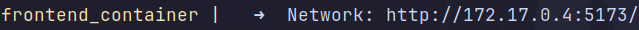
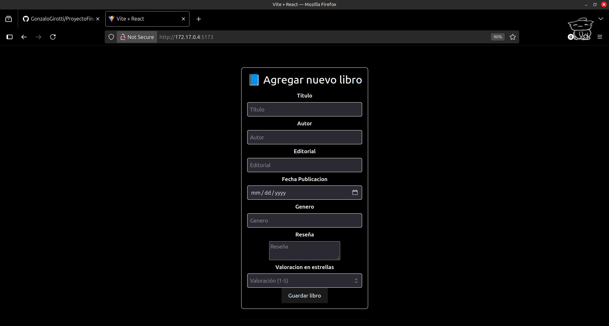

# APLICACION DE BIBLIOTECA

## Funcionalidades:
- Registro de libros.
- Selección de libros por genero.
- Estado de lectura de libros.

## Instalación:
1. Clonar el repositorio:
    ```bash
    git clone https://github.com/GonzaloGirotti/ProyectoFinalProgIII

    ```
2. Navegar al directorio del proyecto:
    ```bash
    cd ProyectoFinalProgIII
    ```

3. Crear las variables de entorno necesarias:
    - Crear un archivo `.env` en el directorio /backend y agregar las siguientes variables:
    ```env
    PORT=4000
    DB_NAME=tu_database_name
    DB_USER=tu_usuario
    DB_PASSWORD=tu_contraseña
    DB_HOST=postgres
    DB_PORT=5432
    ```

    - Crear un archivo `.env` en el directorio /frontend y agregar las siguientes variables:
    ```env
    VITE_API_URL=http://localhost:4000/api/v1
    ```


1. Levantar la app con Docker-Compose:
    ```bash
    docker-compose up --build
    ```
2. Acceder a la aplicación frontend en tu navegador:


   
(o si no lo levantas con docker-compose: localhost:5173)


## Tecnologías utilizadas:

- **Backend**: Node.js, Express, PostgreSQL, Sequelize.
- **Frontend**: React, Vite.
- **Base de datos**: PostgreSQL.
- **Docker**: Para hacer el contenedor de la aplicación y facilitar su despliegue.
- **Docker Compose**: Para levantar los servicios de la aplicación (backend, frontend y base de datos).
- **Github**: Para el control de versiones.

## Endpoints del proyecto:

### Utilizando Postman, puedes probar los siguientes endpoints:

#### Libros (/libros)

    Solicitud POST -> localhost:4000/api/v1/libros
    Registra un nuevo libro. (requiere campos: 'titulo', 'autor', 'editorial', 'genero', 'fecha_publicacion', 'estado_lectura', 'reseña' (opcional), 'valoracion' (opcional, por defecto es 1)).

    Solicitud GET -> localhost:4000/api/v1/libros
    Devuelve todos los libros registrados.

    Solicitud GET -> localhost:4000/api/v1/libros/generos
    Devuelve los géneros de los libros registrados.

    Solicitud GET -> localhost:4000/api/v1/libros/:idLibro
    Devuelve los detalles de un libro específico por su ID.

    Solicitud DELETE -> localhost:4000/api/v1/libros/:idLibro
    Elimina un libro específico por su ID.

    Solicitud PUT -> localhost:4000/api/v1/libros/:idLibro/estado
    Actualiza el estado de lectura de un libro específico por su ID. (requiere campo: 'estado_lectura').

## Screenshots:



## Integrantes del grupo:
    Gonzalo Girotti
    Mariano Garcia Rigano
    Jeremias Diaz
    Marcos Diaz
    Pedro Crowley